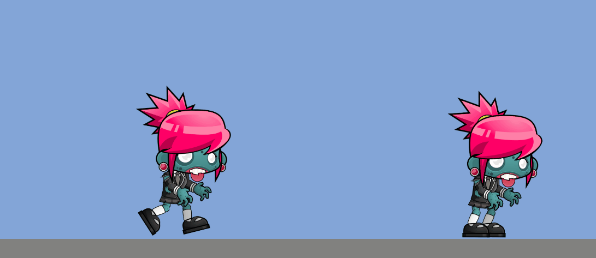
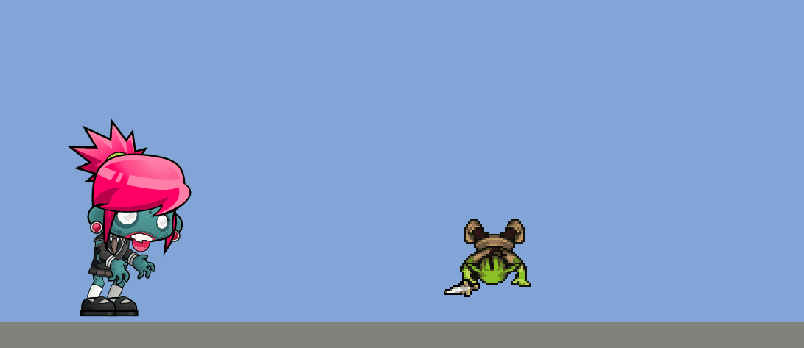
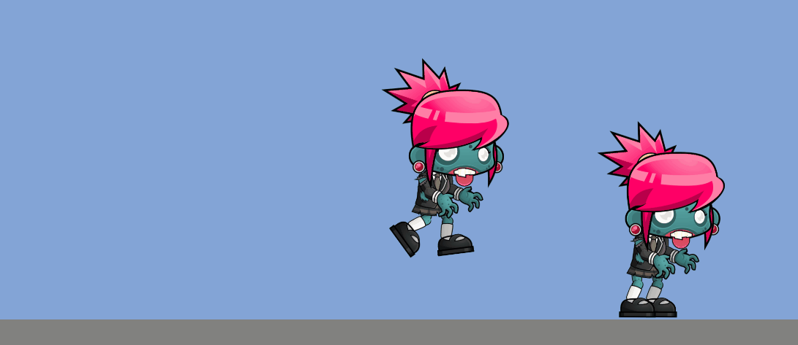
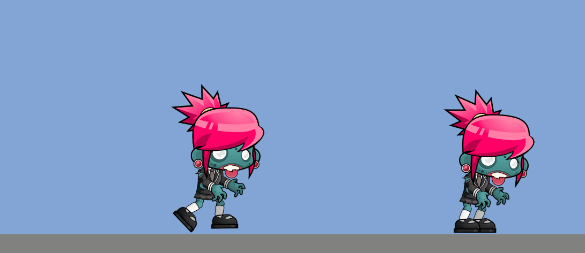
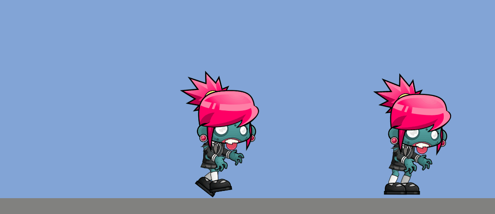
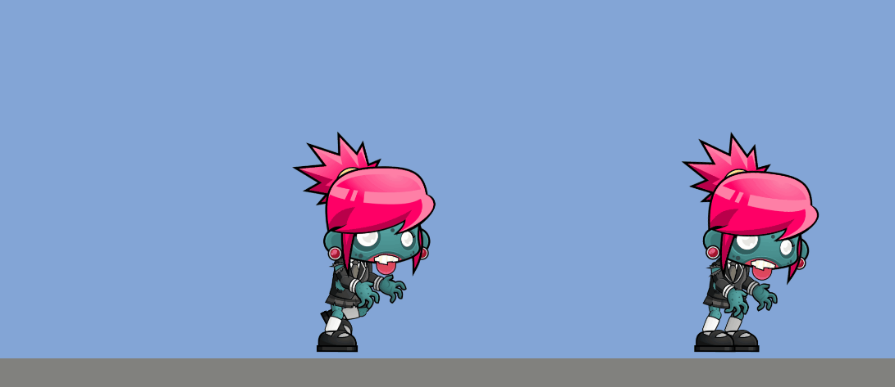
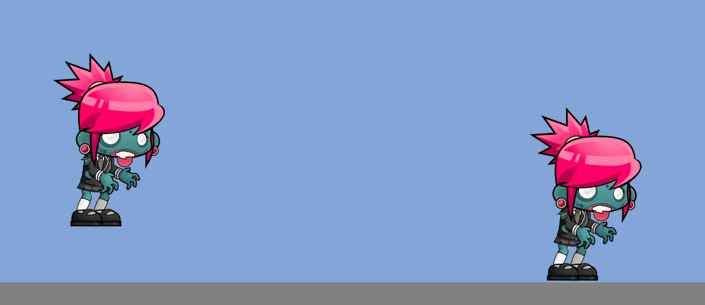

# 🐱‍🐉 Ejercicios sobre Sprites
#### Agregar un Zombie que, al colisionar con él, cambie la animación a Dead

#### Agregar las animaciones al goblin, y hacer que cuando exista colisión active la animación de atacar

#### Sin físicas

#### Un objeto físico otro no

#### Ambos físicos

#### Ambos físicos y uno de ellos tiene 10 veces más masa

#### Uno físico otro isTrigger

#### Uno de los objetos es cinemático.

